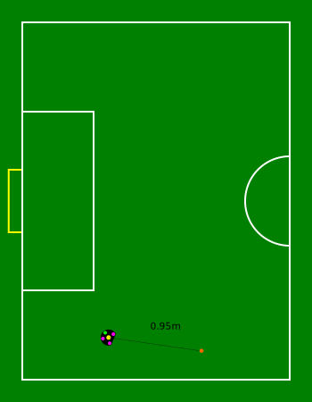
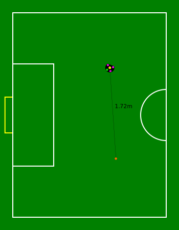
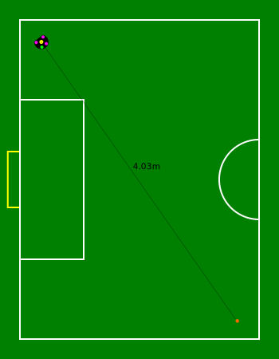
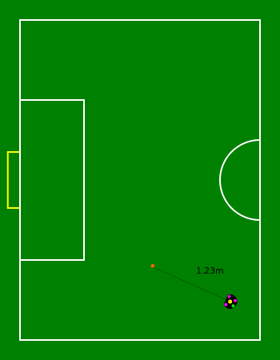
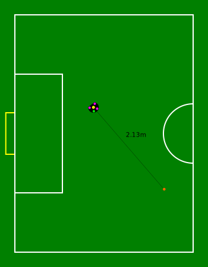
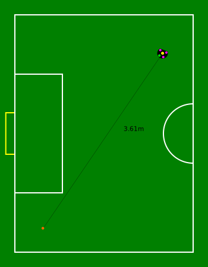
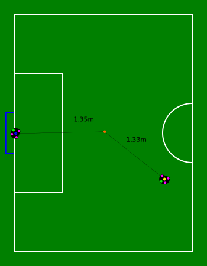
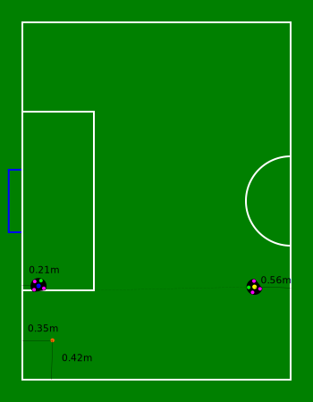

[appendix]

== Stage Scenarios

The scenarios for each stage can be seen below, the team has 3 tries in each
scenario and there are 3 scenarios per stage, the first one being the easiest,
and the last one being the hardest.

=== Stage 1

=== Stage 2

=== Stage 3

image::../vision_blackout_scenarios/stage3_b.svg[Interactive,700,opts=interactive]

