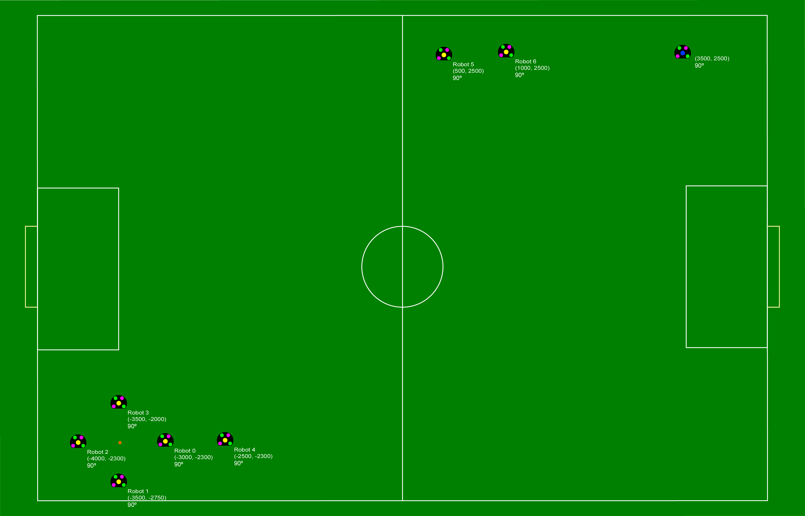

:source-highlighter: highlightjs

= RoboCup 2022 SSL Dribbling Technical Challenge Rules
{docdate}
:toc:
:sectnumlevels: 0

// add icons from fontawesome in a up-to-date version
ifdef::backend-html5[]
++++
<link rel="stylesheet" href="https://use.fontawesome.com/releases/v5.3.1/css/all.css" integrity="sha384-mzrmE5qonljUremFsqc01SB46JvROS7bZs3IO2EmfFsd15uHvIt+Y8vEf7N7fWAU" crossorigin="anonymous">
++++
endif::backend-html5[]

:icons: font
:numbered:

NOTE: References to the male gender in the rules with respect to referees, team
members, officials, etc. are for simplification and apply to both males and
females.

== Goals of the Technical Challenge

Last year we hosted hardware challenges as a way to promote the development of hardware
even though there would be no physical competition. However, we noticed that many teams had
trouble performing the dribbling challenge. Because of that, we decided to keep it as a
technical challenge this year, giving teams more opportunity to work on this. 

== Procedure

Each team will be given a 30 minute slot to complete this challenge, so please do set up before it begins. When the challenge begins, teams are free to start a trail when they are ready, informing the TC or OC that will be observing that they will start. The referee will make sure that all robots are in position according to the Appendix A. If there are no issues, a FORCE_START command will be given and the timer will start. There is no time limit for one trail, however, if the robot breaks any of the rules, the trial will be considered a failure. The team may also opt to stop the trail. The referee will keep score of the gates passed. Each team can do up to three trials. However, if 30 minutes has passed since the start of the challenge and not all trails have been done, those that have not been done will be considered failures. If teams want to modify their code between trails, they are allowed to. During trials teams are not allowed to touch the computer. 

=== Performance of a trial

There are six gates defined in this challenge. A gate is the line between two robots. For a robot to successfully pass a gate, it must cross this line.

The gates are:

* Gate A - between robot 0 and 1
* Gate B - between robot 1 and 2
* Gate C - between robot 2 and 3
* Gate D - between robot 3 and 0
* Gate E - between robot 0 and 4
* Gate F - between robot 5 and 6

The ball starts inside the bots 0-1-2-3 shape, the (blue) robot at the corner.

The robot should then get the ball and do the following procedure:

* Pass with the ball gate A twice
* Pass with the ball gate B twice
* Pass with the ball gate C twice
* Pass with the ball gate D once
* Pass with the ball gate E once
* Pass with the ball gate F once

The robot should finalize the challenge placing the ball around one meter away from robot 6.

See Appendix A for the visualization of the field before the start of the challenge. 

=== Rules

* The standard match rules do not apply. This means:
** The robot is allowed to dribble the ball for more than 1m in this challenge.
** The ball can not go out of the field.
* If the robot loses the ball, the robot is allowed to retrieve the ball again and continue. The time will not be paused.
* The robot is not allowed to touch the obstacles, else the trial is considered failed.

== Evaluation

The trail with the most amount of gates passed will be taken for overall scoring per team. If there is a tie, the fastest one will be used.

The same applies for the overall challenge: the trail with the most amount of gates passed will win the challenge. If there is a tie, the fastest one will be used.

The TC reserves the right to change the evaluation procedure.

== Appendix A: challenge visualization

