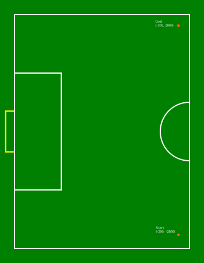
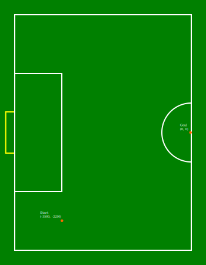
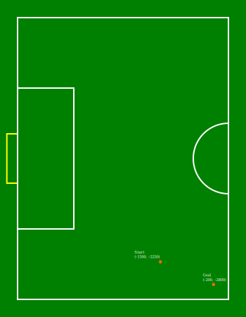
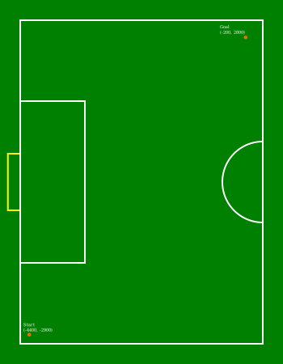
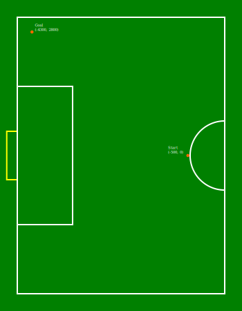
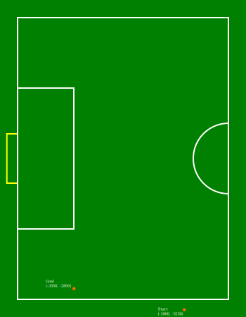
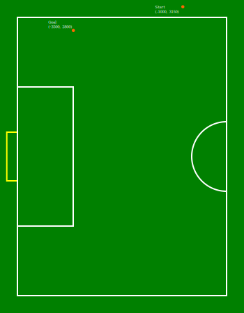
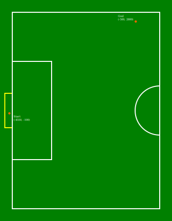

:source-highlighter: highlightjs

= RoboCup 2023 SSL Ball Placement Technical Challenge Rules
{docdate}
:toc:
:sectnumlevels: 0

// add icons from fontawesome in a up-to-date version
ifdef::backend-html5[]
++++
<link rel="stylesheet" href="https://use.fontawesome.com/releases/v5.3.1/css/all.css" integrity="sha384-mzrmE5qonljUremFsqc01SB46JvROS7bZs3IO2EmfFsd15uHvIt+Y8vEf7N7fWAU" crossorigin="anonymous">
++++
endif::backend-html5[]

:icons: font
:numbered:

NOTE: References to the male gender in the rules with respect to referees, team
members, officials, etc. are for simplification and apply to both males and
females.

== Goals of the Technical Challenge

Given the goal of preparing Division B teams to participate in Division A, this
technical challenge aims to encourage Division B teams to develop one of the
skills needed to play a match in Division A. In this case, the challenge is to
autonomously place the ball using the robots ("*AutoPlacement*").

=== Participation Requirements

All Division B teams are eligible and *are encouraged* to participate in this challenge.

== Procedure

The Ball Placement Technical Challenge will be executed using the Game Controller manual controls. Therefore, the procedure is as
follows:

* The Game Controller, SSL Vision and at least one Auto Referee must be already
  running
* Make sure the game state is First Half or Second Half
* The desired position must be set in Game Controller
* The ball must be placed at the indicated position
* The robot(s) must be placed on the middle line of the field
* When all positions are correct, the challenge will start
* A *Stop* command will be issued for *2 seconds*
* Then, the *BALL_PLACEMENT_BLUE/BALL_PLACEMENT_YELLOW* command will be issued

Before and after those commands the game is in Stop state, therefore, the robots are allowed to
position themselves wherever they want before the placement starts, while
following all Stop state rules.

The rules for the AutoPlacement can be found in the
link:https://robocup-ssl.github.io/ssl-rules/sslrules.html#_ball_placement[rule book].

The starting and desired positions of the ball can be seen in the Appendix at
the end of the document. The "Start" is the starting position, and the
"Goal" is the position where the ball must be placed.

In scenarios 6 and 7, the ball must be placed with an **Y** value that the robot cannot get between the ball and the wall, since one of the goals of these scenarios is taking the ball from the boundary.

*Teams are allowed to use up to 6 robots*.

== Evaluation

Every team places the ball in the same scenarios and has 20 minutes to complete all scenarios. The 20 minutes considers the time for completing the challenges and the time for setting up the scenarios, like positioning the ball each try. There are no restrictions on the quantity of tries per scenario, so each team can choose their own strategy to complete the challenge within the time.

The team is responsible for moving the ball to the right place each try. The TC will only check if the positions are correct and will operate the Game Controller.

In total, there will be *8 scenarios* in this challenge. The order of the scenarios will be chosen by the team during the challenge, communicating the next scenario for the TC.

=== Scoring

For every scenario, the following criteria will be evaluated.

* Touching the ball with the dribbler -- +1
* Moving the ball more than 0.5 meter away from the starting position -- +1
* The ball, any time of the try, stopped less than 0.5 meter away from the desired position -- +1
* The ball, when the try is finished, is less than 0.5 meter away from the desired position -- +1
* Completing the ball placement -- +1

For the scenarios 6, 7 and 8, there will be an additional criteria for taking the ball from the boundary.

* Taking the ball out from the boundary -- +1

The best try of each scenario will count.

The partial points of each scenario will be summed. In case of ties, the times for the best try of each scenario will be summed, the fastest team wins.

The TC reserves the right to change the evaluation procedure.

[appendix]

== Scenarios for Ball Placement

=== Scenario 1

=== Scenario 2

=== Scenario 3

=== Scenario 4

=== Scenario 5

=== Scenario 6

=== Scenario 7

=== Scenario 8

